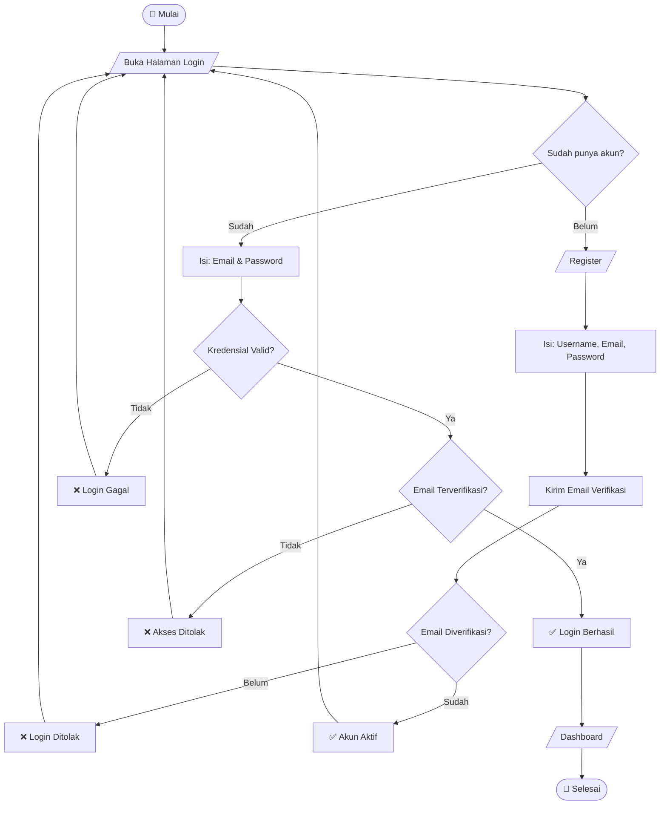
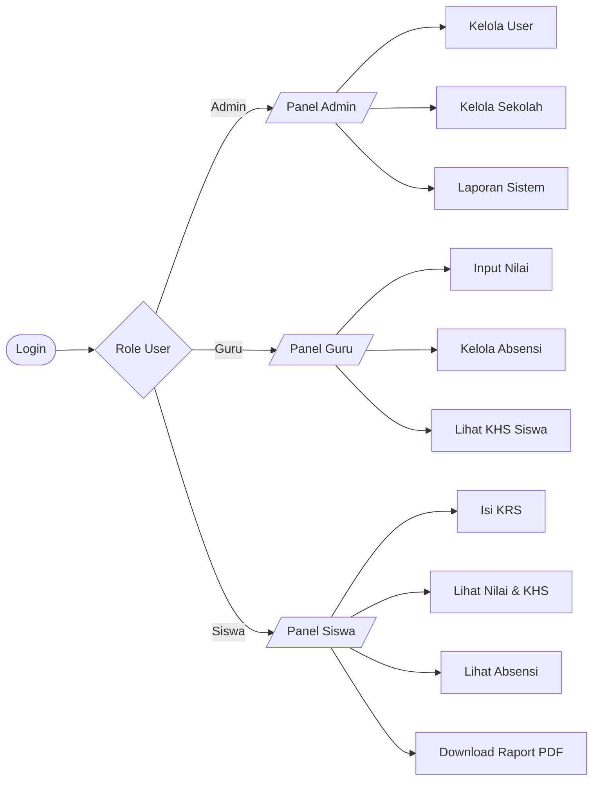
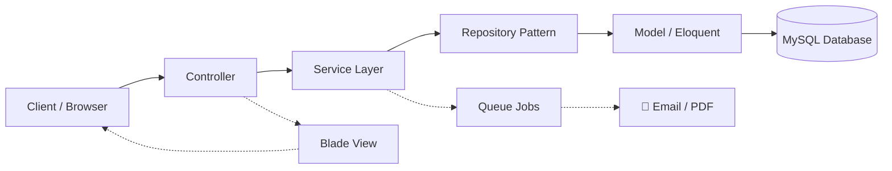

# 🎓 Sistem Informasi Akademik (SIAKAD) — Laravel

> Sistem Informasi Akademik berbasis web yang dibangun menggunakan **Laravel**.  
> Project ini dibuat sebagai tugas mid semester dan terus dikembangkan menjadi sistem akademik yang lebih lengkap, modern, dan scalable.

---

## 🚀 Teknologi yang Digunakan

| Komponen | Detail |
|---|---|
| Framework | Laravel 11 / 12 / 13 |
| Language | PHP 8+ |
| Database | MySQL / MariaDB |
| Frontend | Bootstrap 5 + Blade Template Engine |
| Email Service | SMTP Gmail |
| Authentication | Session-based Login |

---

## 📌 Fitur Utama

### 🔐 Authentication System
- Register user
- Login & Logout
- Session-based authentication
- Password hashing (bcrypt)

### 📧 Email Verification
- Verifikasi email saat registrasi
- Token unik per user
- Blok login sebelum verifikasi
- Aktivasi otomatis setelah verifikasi

### 👤 User Management
- Username & Email
- Password (hashed)
- Status login (0 / 1)
- Verification token

### 🏠 Dashboard
- Dashboard setelah login
- Proteksi route menggunakan session
- Menampilkan status user login

---

## 🔄 Flowchart Sistem

### Alur Autentikasi



### Alur Sistem Akademik



### Arsitektur Sistem



---

## 🧠 Enhanced Features (Roadmap Upgrade)

### 🔐 Security System
- Two-Factor Authentication (2FA)
- Limit login attempts
- Account lock system
- Password strength checker
- IP login tracking

### 👤 User System Advanced
- Role Admin / Guru / Siswa (RBAC)
- Profile user + foto
- Activity log user
- Last login tracking
- Soft delete user

### 🏫 Sistem Akademik
- CRUD Siswa & Guru
- CRUD Mata Pelajaran
- CRUD Kelas & Jurusan
- Manajemen Tahun Ajaran

### 📚 Academic Core
- KRS (Kartu Rencana Studi)
- KHS (Hasil Studi)
- Nilai per semester
- Ranking otomatis
- Raport PDF generator

### 📅 Absensi System
- Absensi harian
- QR Code absensi
- Rekap absensi otomatis
- Status: Hadir / Izin / Sakit / Alpha

### 📊 Reporting System
- Export PDF & Excel
- Grafik dashboard statistik
- Laporan nilai & absensi

### 📡 API System
- REST API Laravel
- Laravel Sanctum authentication
- JSON response standard
- Ready untuk mobile app

### 🎨 UI/UX Upgrade
- Dark mode
- Responsive admin dashboard
- Toast notification
- Loading skeleton
- Multi-language (ID / EN)

---

## 🏗️ Struktur Project

```
resources/views/
├── layouts/
├── auth/
├── dashboard/
├── components/
├── partials/
└── email/

app/Http/Controllers/
└── AuthController.php

database/migrations/
└── users, sessions, password_reset
```

---

## ⚙️ Instalasi Project

### 1. Clone Repository
```bash
git clone https://github.com/username/siakad.git
cd siakad
```

### 2. Install Dependency
```bash
composer install
npm install
```

### 3. Setup Environment
```bash
cp .env.example .env
php artisan key:generate
```

### 4. Setup Database
```env
DB_DATABASE=sistem_informasi_akademik
DB_USERNAME=root
DB_PASSWORD=
```

### 5. Migration
```bash
php artisan migrate
```

### 6. Run Server
```bash
php artisan serve
```

---

## 📧 Konfigurasi Email (Gmail SMTP)

```env
MAIL_MAILER=smtp
MAIL_HOST=smtp.gmail.com
MAIL_PORT=587
MAIL_USERNAME=yourgmail@gmail.com
MAIL_PASSWORD=your_app_password
MAIL_ENCRYPTION=tls
MAIL_FROM_ADDRESS=yourgmail@gmail.com
MAIL_FROM_NAME="SIAKAD"
```

---

## 🧪 Validasi Sistem

| Kondisi | Hasil |
|---|---|
| Email sudah terdaftar | ❌ Error |
| Password salah | ❌ Login gagal |
| Belum verifikasi email | ❌ Ditolak |
| Data valid | ✅ Login sukses |

---

## 📅 Roadmap Pengembangan

### ✅ Phase 1 — Done
- [x] Authentication system
- [x] Email verification
- [x] Dashboard

### 🔄 Phase 2 — In Progress
- [ ] CRUD Siswa
- [ ] CRUD Guru
- [ ] CRUD Mata Pelajaran

### 🔜 Phase 3
- [ ] Absensi system
- [ ] Nilai siswa
- [ ] Laporan PDF

### 🔜 Phase 4
- [ ] Role management
- [ ] Admin panel
- [ ] Middleware access control

### 🔜 Phase 5
- [ ] REST API
- [ ] Mobile integration
- [ ] Vue / React support

---

## 🧪 Testing & Performance

### Testing
- Unit Testing (PHPUnit)
- Feature Testing
- API Testing
- Factory Fake Data

### Performance
- Redis Cache
- Queue Jobs (Email, Report)
- Database indexing
- Lazy loading optimization

---

## 🤝 Kontribusi

```bash
git checkout -b feature/nama-fitur
git commit -m "feat: tambah fitur"
git push origin feature/nama-fitur
```

---

## 👨‍💻 Developer

**Randi Rana** — Full Stack Developer

---

## 📌 Status Project

| Status | Keterangan |
|---|---|
| 🟢 Active Development | Sedang aktif dikembangkan |
| 🟡 Prototype Stage | Masih tahap prototype |
| 🔵 Academic Project | Project akademik |
| 🚀 Future SaaS System | Target jadi sistem SaaS |