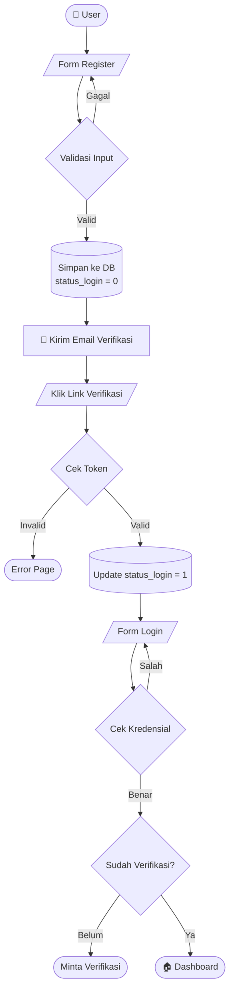

<!-- # 🎓 Sistem Informasi Akademik (SIAKAD) — Laravel

Sistem Informasi Akademik berbasis web yang dibangun menggunakan **Laravel**.  
Project ini dibuat sebagai tugas mid dan akan terus dikembangkan secara bertahap setiap bulan.

---

## 🚀 Teknologi yang Digunakan

| Teknologi | Keterangan |
|---|---|
| Laravel 11/12/13 | Framework utama |
| PHP 8+ | Backend language |
| MySQL / MariaDB | Database |
| Bootstrap 5 | Frontend styling |
| Blade Template Engine | Templating Laravel |
| SMTP Gmail | Email verification |
| Session Authentication | Manajemen login |

---

## 📌 Fitur Utama

### 🔐 Authentication System
- Register user
- Login & Logout user
- Session-based login

### 📧 Email Verification
- Kirim email verifikasi saat register
- Token verifikasi unik per user
- Status user diperbarui setelah verifikasi
- Proteksi login sebelum email diverifikasi

### 👤 User Management

| Field | Keterangan |
|---|---|
| `username` | Nama pengguna |
| `email` | Alamat email |
| `password` | Hashed (bcrypt) |
| `status_login` | `0` = belum verifikasi, `1` = aktif |
| `verification_token` | Token unik email verifikasi |

### 🏠 Dashboard
- Halaman dashboard setelah login berhasil
- Menampilkan status user yang sedang login
- Akses terbatas — hanya untuk user yang sudah login

---

## 📁 Struktur Project

```
resources/views/
├── layouts/
├── auth/
├── dashboard/
├── components/
├── partials/
└── email/

app/Http/Controllers/
└── AuthController.php

database/migrations/
├── users table
├── sessions
└── password reset
```

---

## ⚙️ Instalasi Project

### 1. Clone Repository
```bash
git clone https://github.com/username/siakad.git
cd siakad
```

### 2. Install Dependency
```bash
composer install
npm install
```

### 3. Copy File Environment
```bash
cp .env.example .env
```

### 4. Generate Key
```bash
php artisan key:generate
```

### 5. Setup Database
Edit file `.env`:
```env
DB_DATABASE=sistem_informasi_akademik
DB_USERNAME=root
DB_PASSWORD=
```

### 6. Jalankan Migration
```bash
php artisan migrate
```

### 7. Jalankan Server
```bash
php artisan serve
```

---

## 📧 Konfigurasi Email (Gmail SMTP)

Gunakan **App Password** dari akun Gmail kamu:

```env
MAIL_MAILER=smtp
MAIL_HOST=smtp.gmail.com
MAIL_PORT=587
MAIL_USERNAME=yourgmail@gmail.com
MAIL_PASSWORD=app_password_gmail
MAIL_ENCRYPTION=tls
MAIL_FROM_ADDRESS=yourgmail@gmail.com
MAIL_FROM_NAME="SIAKAD"
```

> 💡 **Cara membuat App Password Gmail:** Buka [myaccount.google.com](https://myaccount.google.com) → Security → 2-Step Verification → App Passwords.

---

## 🔐 Alur Sistem

### Register
1. User mengisi form register
2. Data tersimpan ke database (`status_login = 0`)
3. Email verifikasi dikirim ke user
4. User klik link verifikasi di email

### Verifikasi
1. Token dicek ke database
2. Jika valid → `status_login` diubah menjadi `1`
3. User dapat langsung login

### Login
1. Cek `username` & `password`
2. Cek status verifikasi email
3. Jika valid → diarahkan ke dashboard

---

## 🧪 Validasi Sistem

| Kondisi | Hasil |
|---|---|
| ❌ Email sudah terdaftar | Error — tidak bisa register ulang |
| ❌ Password salah | Error — login ditolak |
| ❌ Belum verifikasi email | Error — login diblokir |
| ✅ Semua valid | Login sukses → masuk dashboard |

---

## 📅 Roadmap Pengembangan

### 📌 Bulan 1 — *Current*
- [x] Authentication system
- [x] Email verification
- [x] Dashboard basic

### 📌 Bulan 2
- [ ] CRUD Data Siswa
- [ ] CRUD Data Guru
- [ ] CRUD Mata Pelajaran

### 📌 Bulan 3
- [ ] Absensi siswa
- [ ] Nilai siswa
- [ ] Laporan PDF

### 📌 Bulan 4
- [ ] Role admin / guru / siswa
- [ ] Middleware role access
- [ ] UI dashboard admin

### 📌 Bulan 5
- [ ] API integration
- [ ] Mobile version *(opsional)*
- [ ] Laravel API + React/Vue *(opsional)*

---

## 🧑‍💻 Developer Notes

> Project ini masih dalam tahap **pengembangan aktif**.  
> Struktur dan fitur akan terus diperbaiki untuk menjadi sistem akademik yang lengkap dan fungsional.

---

## 📌 Status Project

| Status | Keterangan |
|---|---|
| 🟢 Active Development | Sedang aktif dikembangkan |
| 🟡 Prototype Stage | Masih tahap prototipe |
| 🔵 Academic Project | Dibuat untuk keperluan akademik | -->


<div align="center">


<br/>

[](https://laravel.com)
[](https://php.net)
[](https://mysql.com)
[](https://getbootstrap.com)
[](https://gmail.com)

<br/>


<br/>

> **🎓 Sistem Informasi Akademik** berbasis web yang dibangun menggunakan **Laravel**.  
> Project ini dibuat sebagai tugas mid semester dan akan terus dikembangkan setiap bulan  
> menuju sistem akademik yang **lengkap, scalable, dan production-ready**.

<br/>

[📖 Dokumentasi](#-instalasi-project) · [🐛 Report Bug](https://github.com/royandixix/sia-edu-auth-system/issues) · [✨ Request Feature](https://github.com/royandixix/sia-edu-auth-system/issues)

</div>

---

## 📋 Daftar Isi

- [📋 Daftar Isi](#-daftar-isi)
- [🧠 Tentang Project](#-tentang-project)
- [🚀 Tech Stack](#-tech-stack)
- [📌 Fitur Utama](#-fitur-utama)
- [🗂️ Arsitektur Sistem](#️-arsitektur-sistem)
- [⚙️ Instalasi Project](#️-instalasi-project)
  - [Prerequisites](#prerequisites)
  - [Langkah Instalasi](#langkah-instalasi)
- [📧 Konfigurasi Email (Gmail SMTP)](#-konfigurasi-email-gmail-smtp)
- [🔐 Alur Sistem](#-alur-sistem)
- [🧪 Validasi Sistem](#-validasi-sistem)
- [📅 Roadmap Pengembangan](#-roadmap-pengembangan)
- [🤝 Kontribusi](#-kontribusi)
- [👨‍💻 Developer](#-developer)
- [📄 License](#-license)

---

## 🧠 Tentang Project

SIAKAD adalah platform manajemen akademik yang dirancang untuk mengelola data siswa, guru, absensi, nilai, hingga laporan akademik secara terpusat dan efisien. Dibangun di atas fondasi **Laravel** dengan pendekatan **MVC architecture** dan **clean code principle**.

```
🎯 Goal        → Sistem akademik end-to-end yang production-ready
🏗️  Arsitektur  → MVC + Service Layer + Repository Pattern (roadmap)
🔒 Security    → Session Auth + Email Verification + CSRF Protection
📦 Stack       → Laravel + MySQL + Bootstrap 5 + Blade
```

---

## 🚀 Tech Stack

<table>
<tr>
<td align="center" width="120">
<br/><sub><b>Laravel</b></sub>
</td>
<td align="center" width="120">
<br/><sub><b>PHP 8+</b></sub>
</td>
<td align="center" width="120">
<br/><sub><b>MySQL</b></sub>
</td>
<td align="center" width="120">
<br/><sub><b>Bootstrap 5</b></sub>
</td>
<td align="center" width="120">
<br/><sub><b>Git</b></sub>
</td>
</tr>
</table>

---

## 📌 Fitur Utama

<details>
<summary><b>🔐 Authentication System</b></summary>
<br/>

- ✅ Register user dengan validasi lengkap
- ✅ Login & Logout user
- ✅ Session-based authentication
- ✅ CSRF Protection bawaan Laravel
- ✅ Password hashing dengan Bcrypt

</details>

<details>
<summary><b>📧 Email Verification</b></summary>
<br/>

- ✅ Auto-send email verifikasi saat register
- ✅ Token verifikasi unik per user
- ✅ Status user diperbarui otomatis setelah verifikasi
- ✅ Proteksi login sebelum email diverifikasi
- ✅ Blade email template yang rapi

</details>

<details>
<summary><b>👤 User Management</b></summary>
<br/>

| Field | Type | Keterangan |
|---|---|---|
| `id` | `bigint` | Primary key, auto increment |
| `username` | `varchar` | Nama pengguna, unique |
| `email` | `varchar` | Alamat email, unique |
| `password` | `varchar` | Hashed dengan Bcrypt |
| `status_login` | `tinyint` | `0` = unverified · `1` = active |
| `verification_token` | `varchar` | Token unik email verifikasi |
| `created_at` | `timestamp` | Waktu registrasi |

</details>

<details>
<summary><b>🏠 Dashboard</b></summary>
<br/>

- ✅ Halaman dashboard post-login
- ✅ Menampilkan info & status user aktif
- ✅ Route protection via middleware
- ✅ Layout responsif dengan Bootstrap 5

</details>

---

## 🗂️ Arsitektur Sistem

```
sia-edu-auth-system/
│
├── 📁 app/
│   ├── Http/
│   │   ├── Controllers/
│   │   │   └── AuthController.php      ← Core auth logic
│   │   └── Middleware/
│   └── Models/
│       └── User.php
│
├── 📁 database/
│   └── migrations/
│       ├── create_users_table.php
│       ├── create_cache_table.php
│       └── create_jobs_table.php
│
├── 📁 resources/views/
│   ├── layouts/        ← Master layout
│   ├── auth/           ← Login, Register, Verify
│   ├── dashboard/      ← Dashboard views
│   ├── components/     ← Reusable UI components
│   ├── partials/       ← Navbar, Footer
│   └── email/          ← Email templates
│
├── 📁 routes/
│   └── web.php         ← Semua route terdefinisi di sini
│
└── 📁 config/
    ├── auth.php
    ├── mail.php
    └── session.php
```

---

## ⚙️ Instalasi Project

### Prerequisites

Pastikan sudah terinstall:

```bash
php --version   # PHP >= 8.0
composer --version
node --version
mysql --version
```

### Langkah Instalasi

**1. Clone Repository**
```bash
git clone https://github.com/royandixix/sia-edu-auth-system.git
cd sia-edu-auth-system
```

**2. Install Dependencies**
```bash
composer install
npm install && npm run build
```

**3. Setup Environment**
```bash
cp .env.example .env
php artisan key:generate
```

**4. Konfigurasi Database**

Edit `.env`:
```env
DB_CONNECTION=mysql
DB_HOST=127.0.0.1
DB_PORT=3306
DB_DATABASE=sistem_informasi_akademik
DB_USERNAME=root
DB_PASSWORD=
```

**5. Jalankan Migration**
```bash
php artisan migrate
```

**6. Jalankan Development Server**
```bash
php artisan serve
```

🎉 Buka **http://localhost:8000** di browser.

---

## 📧 Konfigurasi Email (Gmail SMTP)

```env
MAIL_MAILER=smtp
MAIL_HOST=smtp.gmail.com
MAIL_PORT=587
MAIL_USERNAME=yourgmail@gmail.com
MAIL_PASSWORD=your_app_password
MAIL_ENCRYPTION=tls
MAIL_FROM_ADDRESS=yourgmail@gmail.com
MAIL_FROM_NAME="SIAKAD"
```

> [!TIP]
> **Cara membuat App Password Gmail:**
> Buka [myaccount.google.com](https://myaccount.google.com) → **Security** → **2-Step Verification** → **App Passwords** → Generate password baru untuk "Mail".

---

## 🔐 Alur Sistem



---

## 🧪 Validasi Sistem

| # | Skenario | Input | Expected Output |
|---|---|---|---|
| 1 | Register email duplikat | Email sudah ada | ❌ Error: Email telah terdaftar |
| 2 | Login password salah | Password tidak cocok | ❌ Error: Kredensial tidak valid |
| 3 | Login belum verifikasi | Account unverified | ❌ Error: Silakan verifikasi email |
| 4 | Login sukses | Data valid + verified | ✅ Redirect ke Dashboard |
| 5 | Akses dashboard tanpa login | No session | 🔄 Redirect ke Login |

---

## 📅 Roadmap Pengembangan

```
2025 ━━━━━━━━━━━━━━━━━━━━━━━━━━━━━━━━━━━━━━━━━━━━━ 2026
  │
  ├─ [✅] Bulan 1 — Auth System
  │        Authentication, Email Verification, Dashboard
  │
  ├─ [🔄] Bulan 2 — Data Master
  │        CRUD Siswa, CRUD Guru, CRUD Mata Pelajaran
  │
  ├─ [ ] Bulan 3 — Akademik Core
  │        Absensi Siswa, Input Nilai, Laporan PDF
  │
  ├─ [ ] Bulan 4 — Role & Access Control
  │        Role Admin/Guru/Siswa, Middleware, Admin UI
  │
  └─ [ ] Bulan 5 — Advanced Features
           REST API, Mobile Version, Laravel + React/Vue
```

| Fase | Fitur | Status |
|---|---|---|
| 🟢 Bulan 1 | Auth + Email Verification + Dashboard | ✅ Done |
| 🟡 Bulan 2 | CRUD Siswa, Guru, Mata Pelajaran | 🔄 Next |
| ⚪ Bulan 3 | Absensi, Nilai, Laporan PDF | 📋 Planned |
| ⚪ Bulan 4 | Role-based Access Control | 📋 Planned |
| ⚪ Bulan 5 | API + Mobile | 📋 Planned |

---

## 🤝 Kontribusi

Kontribusi sangat terbuka! Ikuti langkah berikut:

```bash
# 1. Fork repository ini
# 2. Buat branch fitur baru
git checkout -b feature/nama-fitur

# 3. Commit perubahan
git commit -m "feat: tambah fitur nama-fitur"

# 4. Push ke branch
git push origin feature/nama-fitur

# 5. Buat Pull Request
```

**Commit Convention:**
```
feat:     Fitur baru
fix:      Bug fix
docs:     Update dokumentasi
style:    Formatting, missing semicolons, dll
refactor: Refactoring code
test:     Menambah test
chore:    Update build tasks, dll
```

---

## 👨‍💻 Developer

<div align="center">


**Royandi**

[](https://github.com/royandixix)

*"Code is like humor. When you have to explain it, it's bad."*

</div>

---

## 📄 License

Distributed under the **MIT License**. See `LICENSE` for more information.

---

<div align="center">


**⭐ Jangan lupa kasih star kalau project ini membantu! ⭐**


</div>